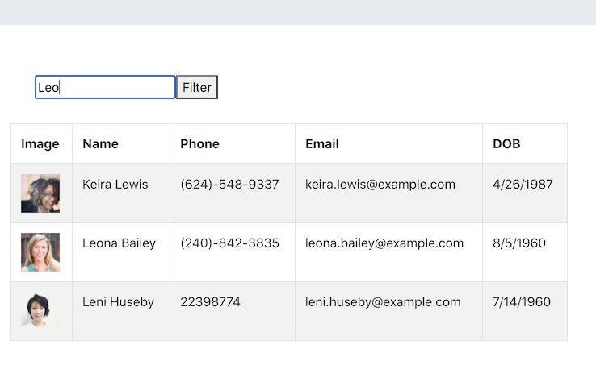

# Employee.Directory

[](https://opensource.org/licenses/MIT)
      
     
## Description

Application that provides a filter and sorting function to make it easier to find a specific employee.

## Table of Contents
 
* [Installation](#installation)
* [Usage](#usage)
* [Credits](#credits)
* [License](#license)
 
## Installation
```
npm install
``` 

## Usage
Visit Employee.Directory [here.](https://lee-amber-alex.github.io/Employee.Directory)

Access the project repository [here.](https://github.com/lee-amber-alex/Employee.Directory) 

##### Home Page
  

##### Filter list:


##### Sort by Name column:
  

## Credit
Data generated from [Random User API.](https://randomuser.me/)

## License
This project is covered under the MIT License.
 
## Tests
```
npm test
``` 

## Questions
- [Email](lee.amber.alex@gmail.com)
- [Github Page](https://github.com/lee-amber-alex)
 
